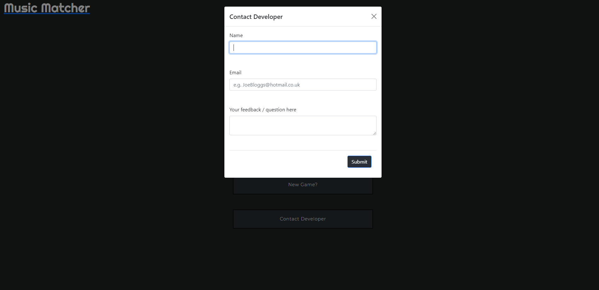

# [Musical Matcher](https://cjepps.github.io/Musical-Matcher/) 

# User experience (UX)

## Strategy
---
The main requirement of this project was to create a memory card game that is fun, requires minimal explanation, and can be enjoyed by an audience of all ages. I anticipate that this game will appeal more to music lovers or people learning music, so I also wanted to include a small educational component to the game. 

## User Stories
---
### Business Goals
- The game needs to incorporate a home page that is visually appealing and straightforward to use. 
- The game needs to be fun to play and easy to understand from the first instance so that users continue to play. 
- The game needs to be fully reponsive on a range of screen resolutions so that a broader audience is reached; If the game is difficult to play on a particular device then we may lose those users.
### User Goals
- I want to know what the website is offering me, with a clear and straightforward layout to enable navigation.
- I want to be able to start the game easiliy and be presented with instructions on how to play the game.
- I want feedback on how well i am doing in the game. 
- I want the option of different difficulty levels.
- I want to contact the developer with any suggestions / feedback for the game. 

## Scope
---
- Home page with logo, start button that presents instructions on how to play the game (Modal). 
- A button that enables users to bring up a contact form to email me (EmailJS API)
- Separate Game page with blank cards laid out in a Grid. 
- A timer that is displayed to the user and starts counting down upon the first card being flipped.
- A reset button 

## Structure
---

### Design
- Color Palette - I've gone for a minimalist styling to complement the musical theme and simplicity of a keyboard. I will use a monochrome color design for the majority of the application and use red (#FF0000) and green (#00FF00) in the game to show correct/ incorrect pairs respectably.

- Typography - I will use the Righteous Font (Google fonts) to style the website icon. Montserrat will be used as the main font with Sans Serif as the fallback in case this does not load.

- Audio - It is my intention that when a user flips a card and reveals an image of a particular musical notation, a relevant sound will play. This will add an educational element to the game where users can practice corresponding musical notation to the sound produced. This would help with abilities such as sight reading. 

- Imagery - I have chosen to style the website and game with a minimalist style to reflect musical notation. I will use an appealing icon for the homepage to entice users to play the game. This icon will match the theme of music that i've used to style the rest of the game. 
## Skeleton
---
### Wireframes - created using Balsamiq
#### Home Page
- iPhone - [View](assets/images/wireframes/homepage-iphone.JPG)
- iPad - [View](assets/images/wireframes/homepage-ipad.JPG)
- Desktop - [View](assets/images/wireframes/homepage-desktop.JPG)
#### Home Page Modal
- iPhone - [View](assets/images/wireframes/homepage-modal-iphone.JPG)
- iPad - [View](assets/images/wireframes/homepage-modal-ipad.JPG)
- Desktop - [View](assets/images/wireframes/homepage-modal-desktop.JPG)
#### Game
- iPhone - [View](assets/images/wireframes/gamepage-iphone.JPG)
- iPad - [View](assets/images/wireframes/gamepage-ipad.JPG)
- Desktop - [View](assets/images/wireframes/gamepage-desktop.JPG)
#### Game Modal
- iPhone - [View](assets/images/wireframes/gamepage-modal-iphone.JPG)
- iPad - [View](assets/images/wireframes/gamepage-modal-ipad.JPG)
- Desktop - [View](assets/images/wireframes/gamepage-modal-desktop.JPG)
## Features
---
### Home page
- Central music themed icon that doubles as a new game button 
- "Contact the Developer" button that opens a modal containing a contact form. Here, users can email their enquiries/ feedback using EmailJS API
### All pages
- Logo for 'Music Matcher' which allows navigation to Home page when clicked.
### Home page modal
- Provides instructions/ rules of the game
- New game section includes three buttons; Beginner, Intermediate, Expert, that allows users to select the difficulty of the game
### Game page
- Game information section displays the time remaining in the game, number of moves made, and a star rating based on number of moves made.
- 4x4 grid of 16 cards that are on a dark background so they are easily visable by the user.
- Cards present a musical notation image when clicked. If a correct pair is clicked then both cards  do not flip back over and a sound is played to notify user of a correct pair. If an incorrect pair is matched then the cards turn back over and a different sound is played to notify the user of an incorrect match .
- Cards emit a flip sound when clicked.
- If the game is completed succesfully, a corresponding victory sound will play and the won game modal will appear.
- If the time limit is reached and the user loses the game, a corresponding gameover sound will play and the Lost game modal will appear. 

### Game page modals
- Modal presents once time limit has been reached (lost game) or all cards have been matched (won game)
### Won game modal 
- Congratulates users with a victory image.
- Includes a game information section that displays; number of moves made, corresponding star rating, and time remaining. 
- Includes a 'Play Again?' button that starts the game again at the previously played difficulty.
- Change difficulty button allows users to start the game again on another difficulty.
- Homepage button returns users to the homepage.
### Lost game modal
- Comiserates users with a game over image 
- Includes a game information section that displays; number of moves made, corresponding star rating, and time remaining. 
- Includes a 'Play Again?' button that starts the game again at the previously played difficulty.
- Change difficulty button allows users to start the game again on another difficulty.
- Homepage button returns users to the homepage.

# Technologies used 
## Languages
---
1. HTML5
2. CSS3 
3. JavaScript

## Additional Frameworks, Libraries, and Programs used
---
3. Bootstrap 4.4.1
* Used the grid system to aid with the responsiveness of the website
4. Font awesome
* Used to provide icons for the website
5. Git
* used for version control
6. GitHub
* used to store pushed code in a repository
7. Balsamiq
* Used to create wireframes at the start of the project
8. jQuery 
* included with bootstrap. 
9. [Googlefonts CDN](https://fonts.google.com/) 
* used to import 'Righteous' and 'Montserrat' fonts to style text
10. [amiresponsive](http://ami.responsivedesign.is/)
* used to create mockups of the website at different resolutions (for the first image of readme)
11. LambdaTest
* used to test responsiveness on a range of browsers 
# Testing
---
### Validator Testing
  No errors were found when passing my HTML, CSS, or JavaScript code through the respective W3C/JSLint validators
 - [HTML Validation (index.html)](assets/images/screenshots/music-matcher-html-test.PNG)
 - [HTML Validation (Game html pages)](assets/images/screenshots/music-matcher-html-test-games.PNG)
 - [CSS Validation](assets/images/screenshots/music-matcher-css.PNG)
 - [JavaScript Validation (script.js)](assets/images/screenshots/music-matcher-js-test.PNG)
 - [JavaScript Validation (sendEmail.js)](assets/images/screenshots/music-matcher-jstest-sendmail.PNG)

 # Testing user stories from UX section
---
## Business Goals
### The game needs to incorporate a home page that is visually appealing and straightforward to use. 
- the home page only has two buttons. These are clearly labelled to aid navigation throughout the site.

### The game needs to be fun to play and easy to understand from the first instance so that users continue to play.
- On selecting 'new game' from the home page, a modal is presented which explains the game and how to play.
- Audio has been added to the game to make it more fun and immersive 
### The game needs to be fully reponsive on a range of screen resolutions so that a broader audience is reached.
- Styling of the website using bootstrap responsive grids ensures that the game can be played easily at all resolutions 

## User Goals
### I want to know what the website is offering me, with a clear and straightforward layout to enable navigation.
- the styling of the home page shows users that this is a musical themed game through the use of a large keyboard image
- The home page includes a button to start a new game. This shows users that this website is a game.
- Clicking the home page logo enable navigation back to the home page.

### I want to be able to start the game easiliy and be presented with instructions on how to play the game.
- when selecting game difficulty, the user is presented with instructions on how to play the game in the modal.

- on entering the game page, a message is displayed in an overlay. This tells the user to click anywhere and the game will begin.
 
### I want feedback on how well i am doing in the game.
- each game page features information on the time remaining in the game and the number of moves made.
 
- If a card is mismatched, a horrible noise is played.
- If a card is matched correctly with another, a pleasant noise is played 
- If the game is won, pleasant audio is played and the victory modal is displayed, congratulating the user .
 
- If the game is lost, a corresponding audio is played and a gamover modal is displayed.
 
### I want the option of different difficulty levels.
- the user can select from three different difficulties in the new game modal.
 
- the user is then directed to the relevant game page for the selected difficulty.
- game difficulty is set using the time available to match all cards; the more time given to complete the game, the easier a difficulty it is. 
### I want to contact the developer with any suggestions / feedback for the game.
- the home page features a button to "contact developer" this opens a modal

 
- The "Contact developer" modal presents the user a form they can complete with their suggestions/ feedback.
- Once the form is submitted, this is sent to my email via the EmailJS service
---
## Further testing 

### EmailJS testing 

- EmailJS api functionality was tested on their website. [test screenshot](assets/images/screenshots/emailjs-test.PNG)

### Browser compatibility 
Lambdatest was used to test the website across a range of browsers

 
# Deployment
---
### Deploying page to GitHub pages from repository
1. Log in to GitHub and locate the [GitHub Repository](https://github.com/CJepps/Musical-Matcher)
2. At the top of the Repository, locate the "Settings" Button on the menu.
    
3. Scroll down the Settings page until you locate the "GitHub Pages" Section.
4. Under "Source", click the dropdown called "None" and select "Master Branch".
5. The page will automatically refresh.
6. Scroll back down through the page to locate the now published site [link](https://cjepps.github.io/Musical-Matcher/) in the "GitHub Pages" section.

### Forking the GitHub Repository

By forking the GitHub Repository we make a copy of the original repository on our GitHub account to view and/or make changes without affecting the original repository by using the following steps...

1. Log in to GitHub and locate the [GitHub Repository](https://github.com/CJepps/Musical-Matcher)
2. At the top of the Repository just above the "Settings" Button on the menu, locate the "Fork" Button.
3. You should now have a copy of the original repository in your GitHub account.

### Making a Local Clone

1. Log in to GitHub and locate the [GitHub Repository](https://github.com/CJepps/Musical-Matcher)
2. Under the repository name, click "Clone or download".
3. To clone the repository using HTTPS, under "Clone with HTTPS", copy the link.
4. Open Git Bash
5. Change the current working directory to the location where you want the cloned directory to be made.
6. Type `git clone`, and then paste the URL you copied in Step 3.

7. Press Enter. Your local clone will be created.

*Deployment steps created with reference to the code institute sample readme (https://github.com/Code-Institute-Solutions/SampleREADME)*

# Credits 
